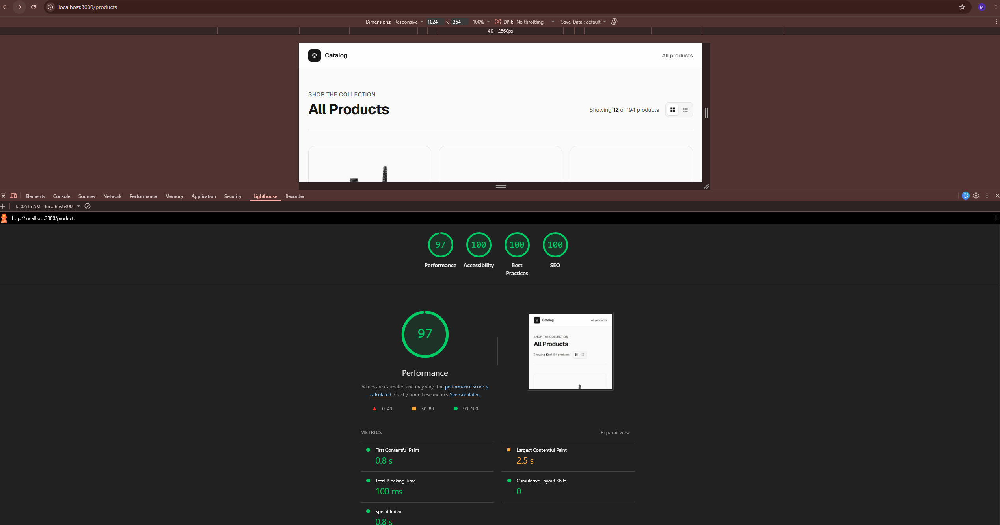

# Product Listings

A small server-rendered product catalogue built with **Next.js (App Router)**, **TypeScript (strict)**, **Tailwind CSS**, **Prisma**, and **PostgreSQL (Neon)**. Products are fetched on the server from a public REST API; a "favourite" interaction is persisted to the database via a Server Action and the per-product favourite count is read back from the database.

## Features

- **`/products`** — server-rendered responsive grid (image, title, price, category). No client-side data fetching for the initial list.
- **`/products/[id]`** — server-rendered detail page, fetched by id, with a proper `404` for unknown/invalid ids.
- **Favourites** — each product card has a "Favourite" button. Clicking it writes a row to the `favourites` table through a Server Action and shows the current count read from the database.
- **Core Web Vitals** — images use `next/image` with explicit `width`/`height` (no layout shift); the only client JS is the small favourite button island, so the initial paint is not render-blocked. The listing is statically prerendered with ISR.
- **Accessibility (WCAG 2.2 AA)** — semantic landmarks, a skip link, alt text, visible `:focus-visible` states, AA-contrast colours, and a fully keyboard-operable favourite button with an `aria-live` count.
- **Structured data** — valid `ItemList` JSON-LD on `/products` and `Product` JSON-LD on the detail page.

## Lighthouse results

Lighthouse run against `/products` (Chrome DevTools):



| Category       | Score |
| -------------- | ----- |
| Performance    | 97    |
| Accessibility  | 100   |
| Best Practices | 100   |
| SEO            | 100   |

Core Web Vitals: **FCP** 0.8 s · **LCP** 2.5 s · **TBT** 100 ms · **CLS** 0 · **Speed Index** 0.8 s.

## Tech stack

| Concern            | Choice                                            |
| ------------------ | ------------------------------------------------- |
| Framework          | Next.js 16 (App Router) + React 19                |
| Language           | TypeScript, `strict: true`                        |
| Styling            | Tailwind CSS v4                                    |
| Database           | PostgreSQL (developed against **Neon**)           |
| DB access          | Prisma 7 with the `@prisma/adapter-pg` driver     |
| Data source        | Public REST API — **https://dummyjson.com/products** |

## Architecture

The code is organised in layers so the framework and external services stay at the edges (a SOLID-driven, dependency-inversion design):

```
src/
  domain/            Entities + repository interfaces (no framework imports)
  infrastructure/
    api/             dummyjson HTTP repository, DTOs, and DTO -> domain mapper
    db/              Prisma client + Prisma-backed favourite repository
    container.ts     Composition root: binds concrete impls to the interfaces
  app/               Routes (Server Components), the favourite Server Action
  components/        Presentational components (one client island: FavouriteButton)
  lib/               Pure helpers (formatting, JSON-LD builders)
```

Pages and the Server Action depend only on the repository **interfaces** in `domain/`; the concrete `DummyJsonProductRepository` and `PrismaFavouriteRepository` are wired in one place (`infrastructure/container.ts`). Swapping the data source or storage engine is a one-line change there.

## Database schema & API contract

`favourites` records one row per (visitor, product) favourite:

| column       | type        | notes                                            |
| ------------ | ----------- | ------------------------------------------------ |
| `id`         | serial PK   |                                                  |
| `product_id` | integer     | the external API's product id                    |
| `session_id` | text        | anonymous per-visitor cookie id                  |
| `created_at` | timestamptz | defaults to `now()`                              |

A unique constraint on `(session_id, product_id)` makes favouriting idempotent and toggleable. The favourite count for a product is `COUNT(*)` over its rows (a single `GROUP BY` query powers the whole grid — no N+1).

**API contract (Server Action):** `toggleFavourite(productId: number): Promise<{ ok: boolean; favourited: boolean; count: number }>` — validates the id, resolves the visitor from the session cookie, inserts or deletes the visitor's row, revalidates the affected routes, and returns whether the product is now favourited along with the fresh count.

## Setup

### Prerequisites

- Node.js 20+
- A PostgreSQL database. This was built with a free [Neon](https://neon.tech) project; any Postgres works.

### Steps

```bash
# 1. Install dependencies (also runs `prisma generate` via postinstall)
npm install

# 2. Configure environment
cp .env.example .env
#   then set DATABASE_URL to your Neon connection string (keep ?sslmode=require)

# 3. Run the database migration (creates the `favourites` table)
npm run db:migrate        # for local dev (creates + applies the migration)
# or, against an already-migrated/prod DB:
npm run db:deploy

# 4. Start the app
npm run dev               # http://localhost:3000  (redirects to /products)
```

### Environment variables

| Variable               | Required | Description                                                        |
| ---------------------- | -------- | ------------------------------------------------------------------ |
| `DATABASE_URL`         | yes      | PostgreSQL connection string (Neon).                               |
| `NEXT_PUBLIC_SITE_URL` | no       | Public origin used for absolute URLs in JSON-LD. Defaults to localhost. |
| `PRODUCT_API_BASE_URL` | no       | REST API base URL. Defaults to `https://dummyjson.com`.            |

## Useful scripts

```bash
npm run dev         # start the dev server
npm run build       # production build
npm run start       # run the production build
npm run typecheck   # tsc --noEmit (strict)
npm run lint        # eslint
npm run db:migrate  # create + apply a migration (dev)
npm run db:deploy   # apply existing migrations (prod/CI)
npm run db:studio   # open Prisma Studio
```

## Trade-off note

Given the one-day limit, I identify each visitor by an **anonymous session cookie** rather than building real authentication. This keeps favourites idempotent and toggleable — a unique constraint on `(session_id, product_id)` means a click favourites and a second click un-favourites — without the cost of a sign-up/login flow. The trade-off is that favourites live with the cookie: they aren't portable across devices or browsers, and clearing cookies loses them. With more time I'd tie sessions to real accounts, add rate limiting on the Server Action, and add a test suite (the repository interfaces are already designed to be mocked, so unit-testing the pages and the action against in-memory fakes is straightforward).
